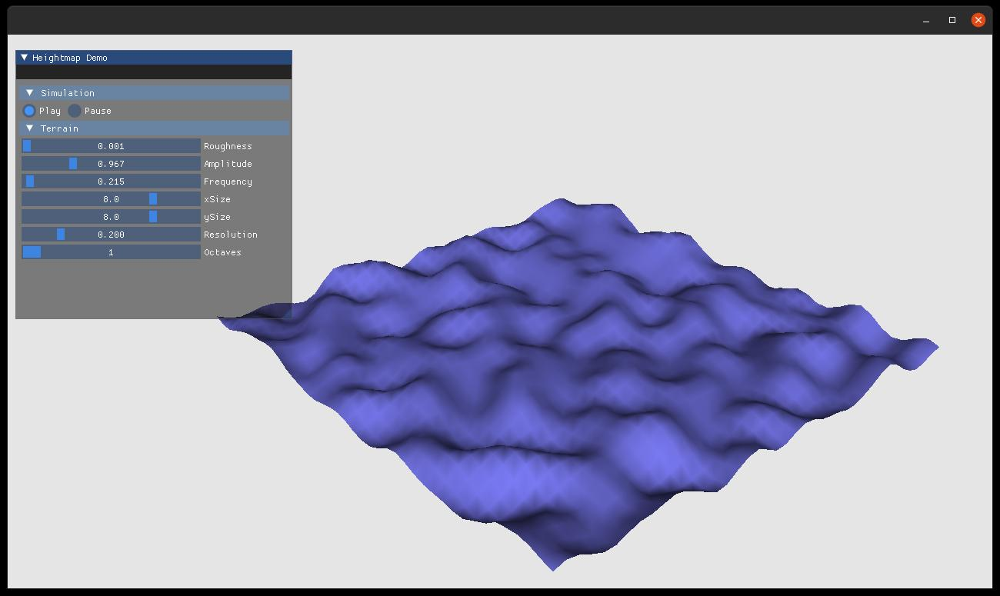
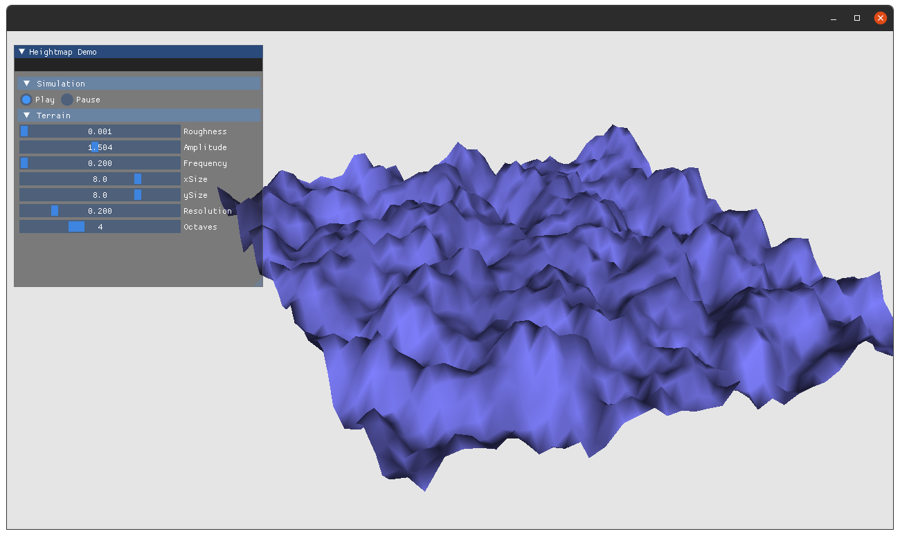
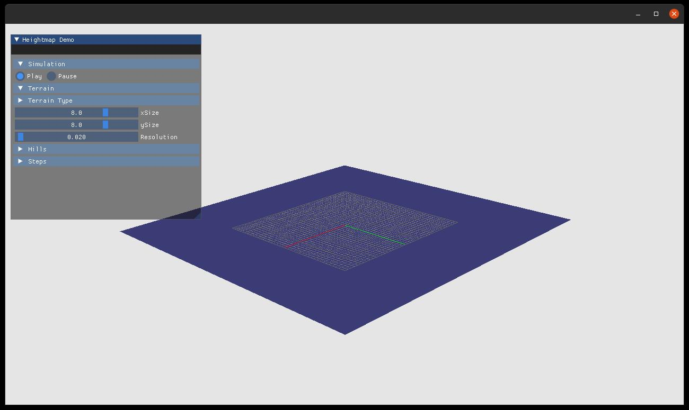
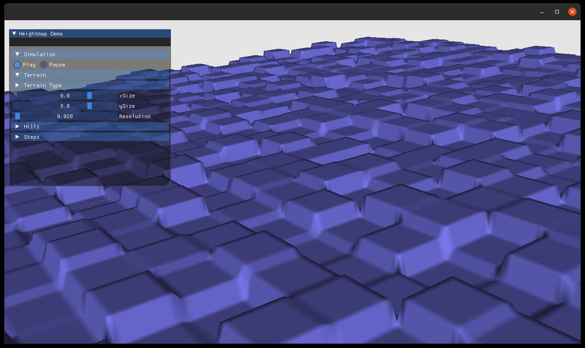

### Terrain Generator

Generate heightmap based terrain for use in simulator that directly support heightmaps.

A GUI based demo can be found here:
https://github.com/ibrahiminfinite/TerrainGenerator-dartsim.git

Here are some example images of what you can do using different parameter settings.

